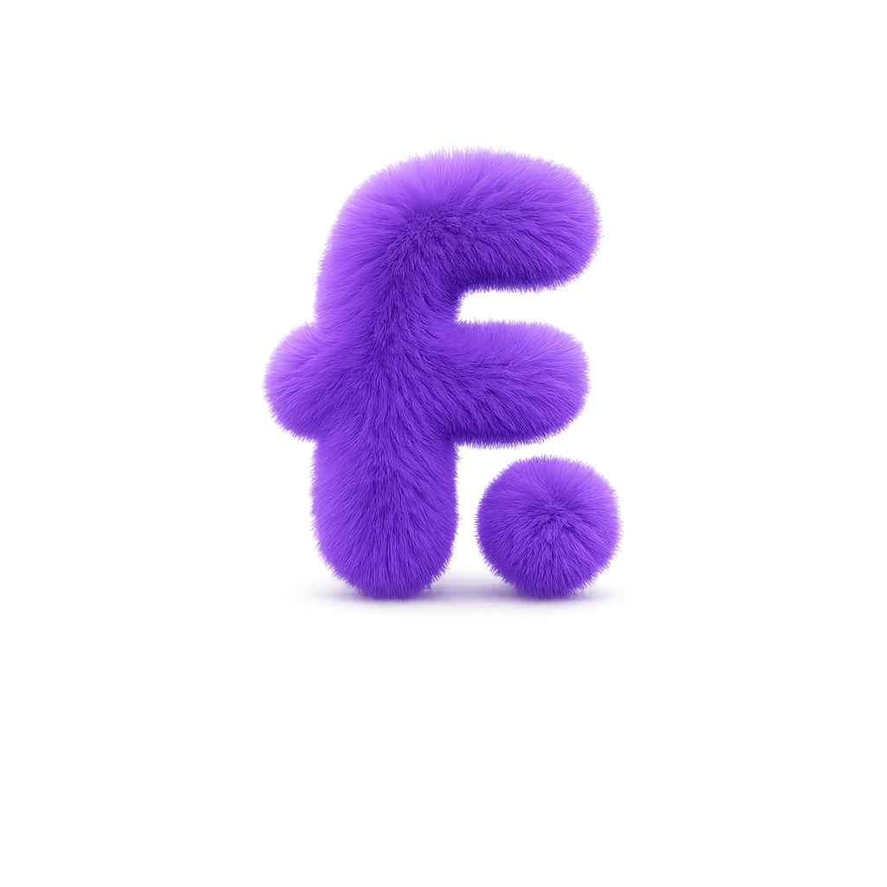

<div align="center">
  
  <h1>FuzzMing</h1>
  <p><strong>LLM-powered fuzzing assistant for any language, any fuzzer</strong></p>
  <p>Point it at a project. It thinks, it fuzzes, it finds bugs.</p>
</div>

---

FuzzMing closes the loop between an LLM and a fuzzer. It generates test contracts, runs them, reads the output, and iterates round after round until it finds every bug, achieves full coverage, or exhausts its round budget.

**Current stack: Solidity + Foundry.** The first supported target is Solidity smart contracts fuzzed with Foundry. But FuzzMing is not a Foundry tool, it is built on hexagonal architecture specifically so that new languages and fuzzers plug in as adapters without touching the core. Rust + cargo-fuzz, Vyper + Echidna, Move + any fuzzer: each is a set of adapters away. The orchestrator, session loop, LLM integration, and report format are language and fuzzer agnostic.

---

## What FuzzMing offers

- **Zero boilerplate:** give it a `.sol` file, it generates the full handler + invariant test suite from scratch
- **Continuous audit:** bugs don't stop the session, FuzzMing strips broken invariants, keeps hunting, and accumulates every finding across all rounds
- **Multi-contract sessions:** target multiple contracts in one run, each gets its own concurrent fuzzing lane
- **Any capable LLM:** OpenRouter, Groq, OpenAI, Anthropic, one flag switches providers
- **Compile error recovery:** if the generated code doesn't compile, FuzzMing feeds the compiler output back to the LLM and retries automatically
- **Coverage feedback:** after each passing round, LCOV coverage gaps are fed back to the LLM so it writes better invariants next time
- **Interactive or headless:** guided prompts for first-time users, `--defaults` / `--from-config` for CI pipelines
- **Demo mode:** `fuzzming run --demo` runs the full UI with mock adapters, no LLM calls, no tokens spent

---

## Prerequisites

| Requirement | Install |
|---|---|
| Rust stable (2021 edition) | [rustup.rs](https://rustup.rs) |
| Foundry (`forge`) — required for the Solidity stack | `curl -L https://foundry.paradigm.xyz \| bash` |
| An LLM API key | OpenRouter, Groq, OpenAI, or Anthropic |

---

## Install

```bash
cargo install fuzzming
```

Or build from source:

```bash
git clone https://github.com/AchrefHemissi/fuzzming
cd fuzzming
cargo install --path .
```

---

## Quick start

Navigate to your Foundry project, then run:

```bash
fuzzming run
```

FuzzMing will prompt you for the target contract(s), model, and API key, then save your answers to `fuzzming.config` so you don't have to repeat them.

### Non-interactive (CI / scripted)

```bash
fuzzming run \
  --targets src/Vault.sol \
  --max-rounds 5 \
  --model openrouter/anthropic/claude-3.5-sonnet \
  --llm-key $OPENROUTER_KEY \
  --defaults
```

### Read everything from config

```bash
# First interactive run saves settings to fuzzming.config
fuzzming run

# All subsequent runs skip every prompt
fuzzming run --from-config
```

### Multiple contracts

```bash
fuzzming run --targets src/Vault.sol src/Token.sol src/Pool.sol --defaults
```

---

## Supported LLM providers

The `--model` prefix selects the provider. Pass the matching API key via `--llm-key` or `LLM_KEY`:

| Prefix | Provider | Example model |
|---|---|---|
| `openrouter/` | OpenRouter | `openrouter/anthropic/claude-3.5-sonnet` |
| `groq/` | Groq | `groq/llama-3.3-70b-versatile` |
| `openai/` | OpenAI | `openai/gpt-4o` |
| `anthropic/` | Anthropic | `anthropic/claude-3-5-sonnet-20241022` |

Sensitive values can be provided via environment variables to keep them out of shell history:

```bash
export LLM_MODEL=groq/llama-3.3-70b-versatile
export LLM_KEY=$GROQ_KEY
fuzzming run --targets src/Vault.sol --defaults
```

---

## fuzzming.config

On first run FuzzMing creates a `fuzzming.config` file in the current directory:

```
targets=src/Vault.sol
max_rounds=5
model=openrouter/anthropic/claude-3.5-sonnet
llm_key=sk-...
workspace_root=.
max_tokens=0
llm_timeout_secs=120
full_coverage_rounds=2
prompt_mode=guided
```

View it (API key masked):

```bash
fuzzming config
```

Delete it and re-prompt:

```bash
fuzzming config --reset
```

---

## Subcommands

| Command | Description |
|---|---|
| `fuzzming run` | Start a fuzzing session |
| `fuzzming guide` | Print the full CLI reference in the terminal |
| `fuzzming report` | Print a summary of the last run's artifacts |
| `fuzzming config` | View or reset the saved `fuzzming.config` |

### `fuzzming run` flags

| Flag | Default | Description |
|---|---|---|
| `--targets <PATHS...>` | — | Paths to target `.sol` files |
| `--max-rounds <N>` | 10 | Maximum fuzzing rounds per contract |
| `--model <ID>` | — | LLM model identifier (`LLM_MODEL` env var) |
| `--llm-key <KEY>` | — | API key for the model's provider (`LLM_KEY` env var) |
| `--workspace-root <DIR>` | `.` | Foundry project root |
| `--max-tokens <N>` | unlimited | Max tokens the LLM may generate per call |
| `--llm-timeout-secs <N>` | 120 | Per-call LLM timeout in seconds |
| `--full-coverage-rounds <N>` | 2 | Consecutive 100%-coverage rounds before stopping |
| `--defaults` | false | Skip all prompts; use flags and env vars |
| `--from-config` | false | Skip all prompts; read everything from `fuzzming.config` |
| `--interactive` | false | Force interactive prompts even when config exists |
| `--demo` | false | Mock run — full UI, no LLM calls, no tokens spent |
| `--verbose` | false | Enable verbose trace logs |

---

## How it works

Each fuzzing round follows this sequence:

```
1. Reader   — reads the target contract + previous-round artifacts
2. Generator — assembles a prompt, calls the LLM, parses the response
3. Executor  — writes generated Handler.sol + InvariantTest.sol + foundry.toml patch
4. Fuzzer    — runs `forge test --profile fuzzming` across all contracts
5. Orchestrator — accumulates bugs, strips confirmed invariants, checks termination
6. Reporter  — emits a formatted result when a contract's session ends
```

The session ends on **full coverage or round exhaustion** — not on the first bug. When an invariant breaks, FuzzMing records it, removes it from the next round's test, and keeps hunting for more bugs.

### Round outcomes

| Outcome | Action |
|---|---|
| Bug confirmed | Record bug, strip broken invariant, continue |
| Compile error | Feed compiler output to LLM, retry next round |
| Developer test failed | Feed error to LLM, retry next round |
| Full coverage reached | Stop — no more gaps to cover |
| Round budget exhausted | Report all bugs found across all rounds |

---

## Exit codes

| Code | Meaning |
|---|---|
| `0` | Clean — all invariants passed, full coverage reached, or exhausted with no bugs |
| `1` | Bugs found or tests failed — treat as build failure in CI |

---

## Logging

```bash
# Round-by-round progress
fuzzming run --verbose --targets src/Vault.sol ...

# Fine-grained tracing (via RUST_LOG)
RUST_LOG=debug fuzzming run --targets src/Vault.sol ...
```

---

## Contributing

FuzzMing is built on hexagonal architecture so that every language and fuzzer is a first-class citizen. Adding a new stack (Rust, Vyper, Move, Echidna, Medusa, cargo-fuzz) means writing new adapters: the orchestrator, session loop, LLM integration, and report format never change. That is the core design bet. The technical documentation for collaborators lives in [docs/](docs/):

| Document | What it covers |
|---|---|
| [docs/orchestrator.md](docs/orchestrator.md) | Session loop, termination logic, round coordination |
| [docs/generator.md](docs/generator.md) | 3-stage LLM call chain, prompt assembly, retry/repair |
| [docs/executor.md](docs/executor.md) | Write gateway — Solidity files, foundry.toml |
| [docs/fuzzer.md](docs/fuzzer.md) | Forge subprocess, output parsing, coverage |
| [docs/reader.md](docs/reader.md) | Read gateway — source files, coverage context |
| [docs/reporter.md](docs/reporter.md) | Report formatters and output adapters |
| [docs/shared.md](docs/shared.md) | Shared data layer — models, ports, requests, responses |
| [docs/entry.md](docs/entry.md) | CLI entry point — subcommands, flags, exit codes |
| [docs/composition.md](docs/composition.md) | Composition root — full wiring graph |

To add a new language or fuzzer, see the checklist in [docs/composition.md](docs/composition.md).

**How to contribute:**

1. Fork the repo and create a branch from `main`.
2. Read [docs/shared.md](docs/shared.md) first — understanding the shared data layer is the fastest way to orient yourself.
3. Keep changes inside one component if possible; cross-component changes must go through `src/shared/`.
4. Run `cargo test` before opening a PR — the fuzzer integration tests require Foundry to be installed.
5. Open a PR against `main` with a clear description of what changed and why.

---

## Contributors

Every contribution matters: code, docs, bug reports, ideas. Thank you to everyone who helps grow FuzzMing.

<div align="center">
  <table>
    <tr>
      <td align="center" style="padding: 16px;">
        <a href="https://github.com/AchrefHemissi">
          <br /><br />
          <b>AchrefHemissi</b>
        </a>
      </td>
      <td align="center" style="padding: 16px;">
        <a href="https://github.com/Dhia9030">
          <br /><br />
          <b>Dhia9030</b>
        </a>
      </td>
      <td align="center" style="padding: 16px;">
        <a href="https://github.com/HanineKhemir">
          <br /><br />
          <b>HanineKhemir</b>
        </a>
      </td>
    </tr>
  </table>
</div>

---

## License

Licensed under the [Apache License, Version 2.0](LICENSE).

```
Copyright 2026 FuzzMing Contributors

Licensed under the Apache License, Version 2.0 (the "License");
you may not use this file except in compliance with the License.
You may obtain a copy of the License at

    http://www.apache.org/licenses/LICENSE-2.0

Unless required by applicable law or agreed to in writing, software
distributed under the License is distributed on an "AS IS" BASIS,
WITHOUT WARRANTIES OR CONDITIONS OF ANY KIND, either express or implied.
See the License for the specific language governing permissions and
limitations under the License.
```
